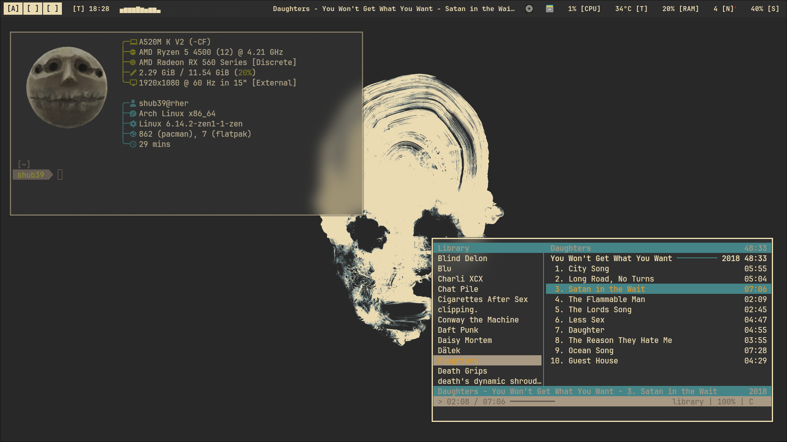
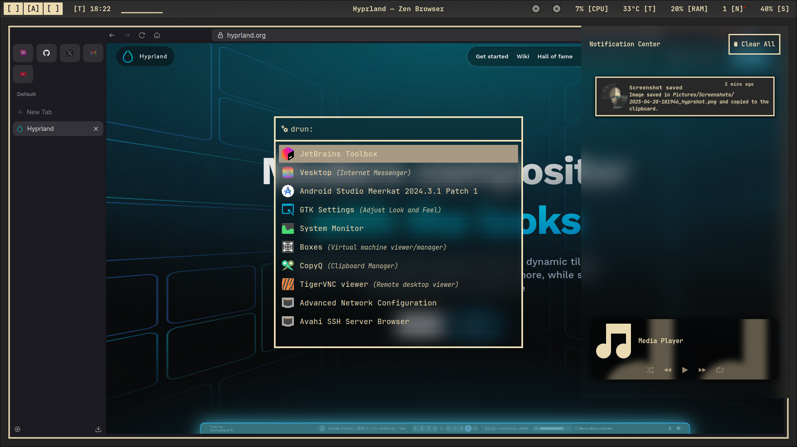
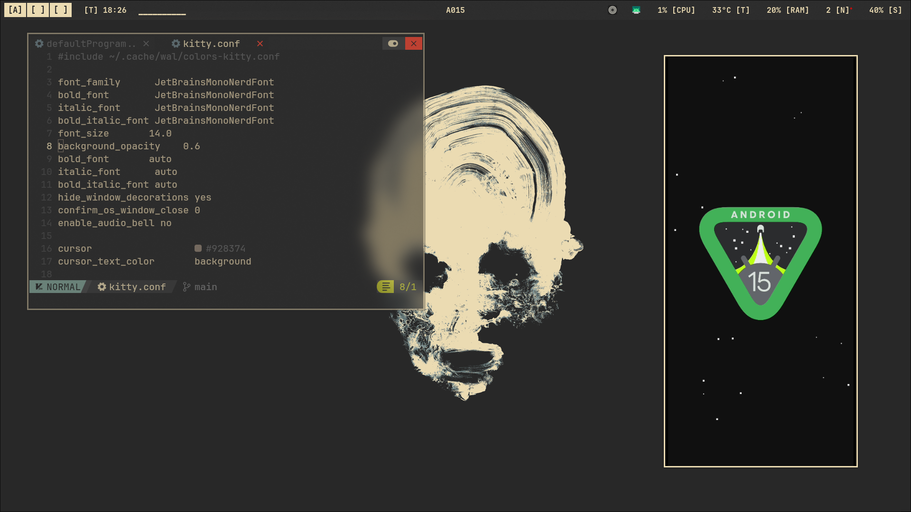
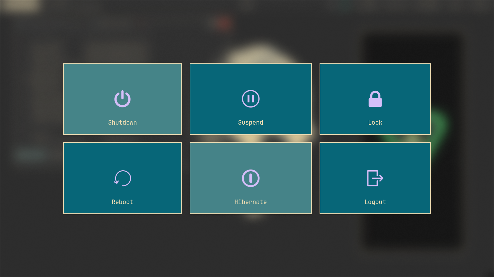

# **`Lucashdml's` Hyprland Dotfiles**

## Screenshots





> [!WARNING]
> This is a fork of ``https://github.com/shub39/dotfiles`` , I restructured the directories and files to use it with gnu stow and did some minor changes to my liking, 
## Packages

### Official Repo
Needed
```
ttf-jetbrains-mono ttf-jetbrains-mono-nerd hyprpicker hyprpaper neovim polkit-gnome nwg-look noto-fonts noto-fonts-emoji noto-fonts-extra noto-fonts-cjk swaync waybar hyprlock gnome-terminal chromium cava scrcpy nemo rofi-wayland cmus copyq flatpak fastfetch imagemagick exa stow starship yazi
```

My preferred extras
```
mpv loupe gnome-boxes gnome-disk-utility gnome-system-monitor nemo-fileroller
```

### AUR
```
gruvbox-dark-icons-gtk gruvbox-material-gtk-theme-git hyprshot wlogout zen-browser-bin hyprsunset
```

### Flatpak
```
it.mijorus.smile
```

## Installation

- Clone this repo in your home directory

```bash
git clone https://github.com/Lucashdml/dotfiles
```
- Go into the dotfiles directory on your home with cd and use 
`stow */`

- Edit `~/.config/hypr/hyprland.conf` to only include `source = ~/.config/dotfiles/hyprland/hyprland.conf`
```bash
echo 'source = ~/.config/dotfiles/hyprland/hyprland.conf' > ~/.config/hypr/hyprland.conf
```

- Reboot

## Extras

- [Lumi](https://github.com/shub39/lumi) waybar module to display synced lyrics of your current playing song
- [NvChad](https://nvchad.com/) a preconfigured neovim setup
- [Zsh config](https://github.com/pixegami/terminal-profile) for this setup, **edit the scripts according to your package manager first**
